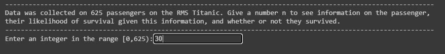
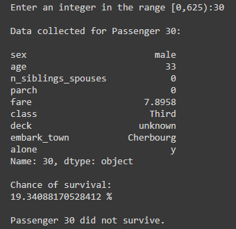

A simple linear regression model predicting the survival of passengers on the Titanic, given several features, including age, fare, sex, class, town of origin, whether or not they were alone.

This data was found on [OpenML](https://www.openml.org/d/40945). The model was trained in batches of 32 (the size of the whole dataset is only 625), using 10 epochs.

### Statistical biases to keep in mind
* Female passengers and passengers under the age of 10 have a much higher chance of survival due to the "women and children first" rule popular for the time.
* Most passengers are male.
* Most passengers are in their 20's or 30's.
* Most passengers held a third class ticket.

# How to Use
1. Install requirements
```
pip install -r requirements.txt
```
2. Run
```
python training_model.py
```
3. Enter a value

4. View statistics; the linear estimator predicts a chance of survival given the various features of the specific data point.

